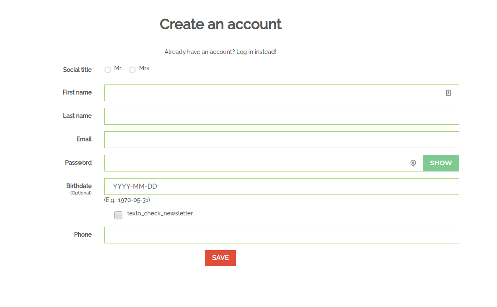

# prestashop-phone-field-for-registration
this module allow to add phone field in registration form, you can use same module as template to create other fields

##Installation
1. download the archive from [GitHub](https://github.com/taoufiqaitali/prestashop-phone-field-for-registration/archive/master.zip)
2. rename prestashop-phone-field-for-registration-master zip and folder to **regphonefield**
3. install from prestashop backoffice like any other module
4. Clear cache and enjoy

##To create other fields
1. Download repository 
2. search "phone" and replace with your field name
3. Follow installation steps

##changeLog
1.0.0 initial release

1.1.0 upgrade to work with 1.7.6+

